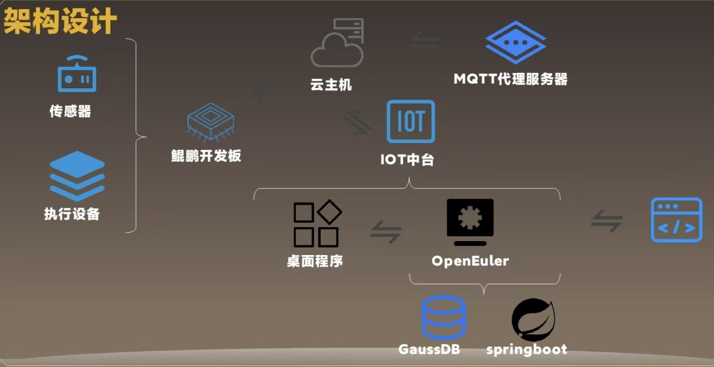
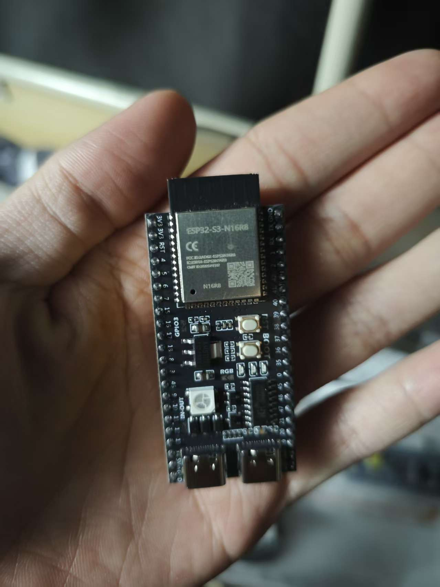
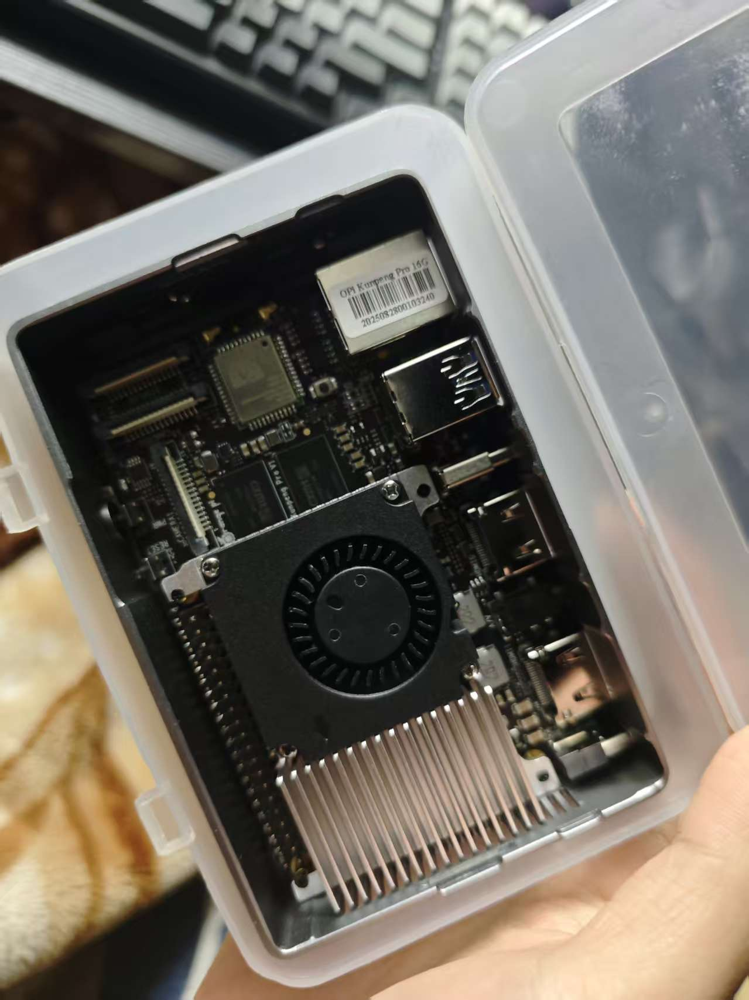

# 居无忧 — 聋哑人智能生活助理 🦻

<div align="center">
  
**让无声世界，也能感知生活的温度** ❤️

[](https://opensource.org/licenses/Apache-2.0)
[](https://www.python.org/)
[](https://www.tensorflow.org/lite)
[](https://spring.io/projects/spring-boot)

</div>

## 📖 项目简介

"居无忧"是一款面向聋哑人群体的智能生活辅助系统，通过多模态感知与 AI 交互技术，帮助用户听懂环境声音、表达自我语言、安全居家生活。系统融合边缘计算与云端智能，提供完整的无障碍生活解决方案。

> **设计理念**：*"不是替代耳朵，而是延伸感知。"*  
> —— 我们不做'治愈'，只做'赋能'

##核心功能

### 环境声识别
- **技术实现**：ESP32 实时采集 + Python 声音分类模型
- **用户价值**：识别门铃、火灾警报、婴儿哭声等关键声音，通过震动/灯光提醒用户

### 语音转文字
- **技术实现**：鲲鹏派运行 Whisper
- **用户价值**：将他人说话实时转为屏幕文字，辅助日常沟通

### 文字转语音
- **技术实现**：TTS 引擎）
- **用户价值**：用户输入文字，系统朗读给健听人听，实现双向交流

### 手语识别
- **技术实现**：摄像头 + MediaPipe / 百度api
- **用户价值**：识别简单手语动作，转换为语音或文字输出

## 🛠️ 系统架构

<div align="center">
  
  <br>
  <em>系统整体架构图</em>
</div>

## 🔧 硬件设备

<div align="center">

| 设备 | 图片 | 主要功能 |
|------|------|----------|
| **ESP32-S3 边缘采集端** |  | 音频采集、环境感知、Wi-Fi 数据传输 |
| **鲲鹏派 AI 推理端** |  | AI 模型推理、多模态数据处理 |

</div>

## 🏗️ 技术栈

### 边缘设备层
- **ESP32-S3** (C/C++, PlatformIO)：音频采集、Wi-Fi 上传
- **鲲鹏派 HiKey 960** (ARM Linux)：运行轻量化 AI 模型

### AI 处理层 (Python)
- **环境声分类**：TensorFlow Lite / YAMNet
- **语音识别**：Whisper.cpp / ASR SDK
- **手语识别**：OpenCV + MediaPipe Hands

### 服务层 (Java)
- **Spring Boot 后端**：用户管理、设备绑定、消息推送
- **WebSocket**：实时传输识别结果到手机/平板 App

## 📁 项目结构

```bash
juwuyou/
├── esp32-s3/           # ESP32 音频采集固件 (C/C++)
├── kunpeng-board/      # 鲲鹏派 AI 推理代码 (Python/C++)
├── ai-services/        # Python AI 模块 (语音/手语/环境声)
├── backend/            # Java 后端服务
├── images/             # 项目截图和文档图片
│   ├── 20251116013150_331_1.jpg
│   ├── 20251116013152_332_1.jpg
│   └── 20251116013632_333_1.jpg
└── README.md
```

## 🎯 应用场景

"居无忧"聚焦真实生活场景，解决聋哑人群体的实际痛点：

- 🏠 **独居安全**：老人听不到燃气泄漏报警？系统及时提醒
- 👶 **育儿关怀**：孩子哭闹时父母无法及时察觉？声音识别主动告警
- 📦 **日常沟通**：与快递员、外卖员沟通困难？双向翻译搭建沟通桥梁
- 🚨 **紧急预警**：火灾警报、门铃等重要声音不漏接

## 🚀 快速开始

### 硬件准备
1. ESP32-S3 开发板
2. 鲲鹏派
3. 麦克风阵列
4. 摄像头模块


## 贡献指南

我们欢迎所有形式的贡献！请阅读 [CONTRIBUTING.md](CONTRIBUTING.md) 了解如何参与项目改进。

## 许可证

本项目采用 Apache License 2.0 开源协议 - 查看 [LICENSE](LICENSE) 文件了解详情。


<div align="center">


</div>
